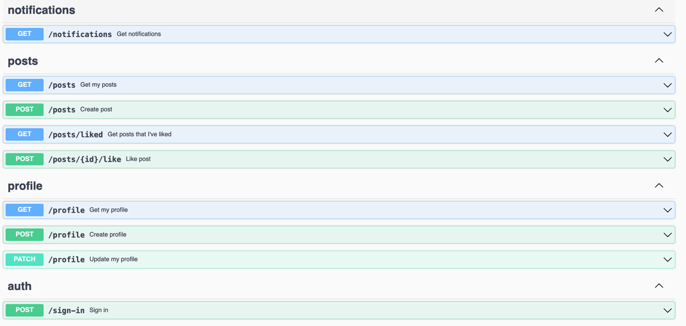

# Social-network test project

## App description
Small prototype of a social network with Profile and Feed features.


### How to use the app
To interact with the app after authentication, open http://localhost:8085/swagger/index.html

Firstly call methods
- POST `/profile/create`
- or POST `/sign-in`

to authorize and get Cookie. Then it's possible to call all rest endpoints.


## How to run the app
```bash
git clone 
# cd <project>
docker compose up
go run ./app
```

Now the server is listening on `localhost:8085`

## API endpoints
See swagger



## Tech stack
- Go
- net/http
- MongoDB
- Swagger


## Additional info
Application is a test project, not applicable for production use.

Many aspects are simplified, like
- storing session in memory
- usage of native http/net library with corresponding drawbacks as it's too basic
- not using proper file structure as I don't know yet which one is common in Go projects
- i've never worked with mongo before so was trying to make it SQL'ish by using separatins of entities to collections as to different SQL tables. This approach is probably wrong

**TLDR**: the code is really shitty because of with experience of writing Go project and using MongoDB.

## Things to improve
- [ ] Use onion architecture - separate application to layers:
  - [ ] Separate controllers, service and db access layers - introduce Service files and repositories
  - [ ] Use dependency inversion to pass data access objects
- [ ] Move all hardcoded configs to environment variables
- [ ] Introduce Redis for storing auth sessions
- [ ] Add framework to avoid mess with HTTP methods and URL path params parsing
- [ ] Add proper validation for requests (minLength for name, password, etc.)
- [ ] Add support for Server-sent Events (SSE) to send notifications on posts liking